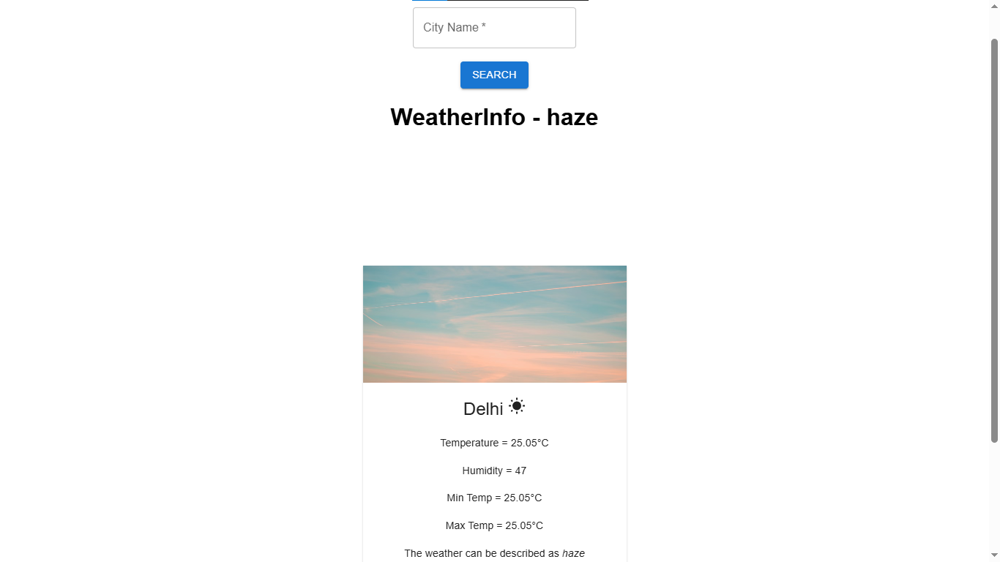

<!-- Weather App README -->
# Weather App 🌦️

This is a React-based Weather App that fetches real-time weather data using the **OpenWeather API**. It features a clean UI using **Material UI** components and provides dynamic weather updates with icons and images that adjust based on API responses.

## Features 🚀
- **Material UI Components:** Used for clean and modern design.
- **Search Functionality:** Fetches real-time weather data for any city.
- **Dynamic Icons & Images:** Displays different weather icons and background images based on API responses.
- **Optimized State Management:** Implements a modular design pattern using separate components (`SearchBox`, `InfoBox`, and `WeatherApp`).

## Tech Stack 🛠️
- **React.js**
- **Material UI**
- **OpenWeather API**

---

## Screenshot 🖼️


## How It Works 🔧
### 1️⃣ **Search for a City**
The `SearchBox` component allows users to search for a city. It sends a request to the OpenWeather API and fetches weather data.
```jsx
<TextField label="City Name" variant="outlined" required onChange={handleChange} />
<Button variant="contained" type="submit">Search</Button>
```

### 2️⃣ **Displaying Weather Information**
The `InfoBox` component dynamically updates the UI with Material UI `Card` components.
```jsx
<Card>
  <CardMedia image={weatherImage} title={info.weather} />
  <CardContent>
    <Typography variant="h5">{info.city} {getWeatherIcon()}</Typography>
    <Typography variant="body2">Temperature: {info.temp}°C</Typography>
  </CardContent>
</Card>
```

### 3️⃣ **Dynamic Icons & Backgrounds**
Weather conditions are visualized using Material UI icons and Unsplash images.
```jsx
const getWeatherIcon = () => {
  if (info.humidity > 80) return <ThunderstormIcon/>;
  if (info.temp > 15) return <WbSunnyIcon/>;
  return <AcUnitIcon/>;
};
```

Background images change dynamically based on the weather:
```jsx
const weatherImage = info.humidity > 80 ? RAIN_URL : info.temp > 15 ? HOT_URL : COLD_URL;
```

---
## Installation & Usage 🏗️
### 1️⃣ Clone the repository
```sh
git clone https://github.com/cb-786/Weather-App-Using-React.git
cd Weather-App-Using-React
```
### 2️⃣ Install dependencies
```sh
npm install
```
### 3️⃣ Run the app
```sh
npm run dev
```

---

